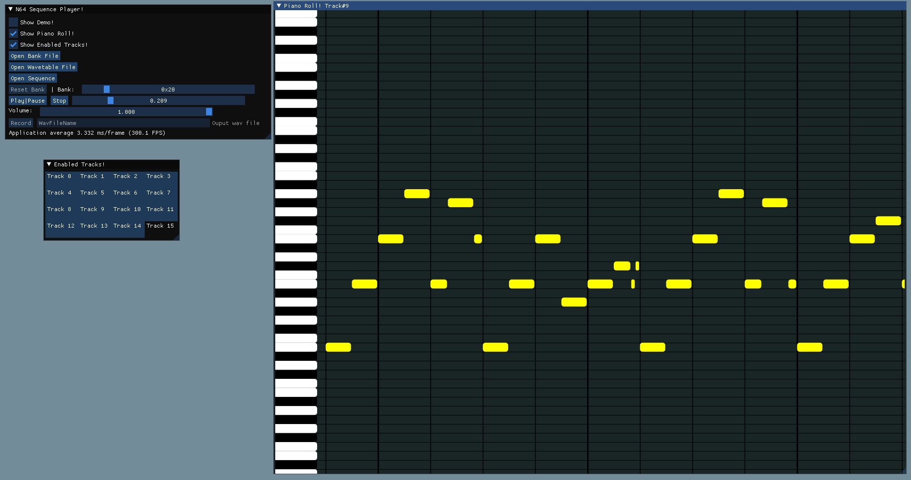

  # Tracker64 🛤️

  
  ## Get Started 🚀
  [TODO]
  ## Instructions 📝
  First you must aquire the bank file, wavetable file, and sequence files of the N64 game in question to be able to do anything at the moment.

  For reasons beyond the scope of this readme, wavetable files need to be converted to little endian by reversing the order of the bytes in each 32bit word due to how the N64 rsp functions. I am still contemplating wether the conversion should happen in the code or to the data. For now it is the data.
  
  ### Steps To Reproduce Audio 🔊
  1. Click [Open Bank File] and select the appropriate file (usually *.ctl)
  2. Click [Open Wavetable File] and select the appropriate file (usually *.tbl, however I use *.ztbl to denote little endian)
  3. Click [Open Sequence] and select an appropriate sequence file (usually *.seq)
  4. The bank selected will be the on denoted on the scroll bar, but you can feel free to change it by moving the scroll bar and selected [Reset Bank]. This can only be done when song is not playing.
  5. Click [Play|Pause] to listen.

  ### Other Playback Controls ▶️
  - [Play|Pause] will also pause track.
  - [Stop] will move sequence to beginning.
  - Moving scroll bar next to [Stop] will move the sequence to specific location. (Currently buggy songs that loop inbetween)
  - Moving scroll bar next to [Volume:] changes Volume
  - Hitting [Record] will save a .wav file of the current sequence from the current location to the end with only the enabled tracks on. The file will be saved to the root directory of the executable with the name of the text next to [Record]
  - Click [Show Enabled Tracks!] to find a grid of highlighted tracks showing the enabled tracks for the current sequence. You can toggle those on and off.

  ### Piano Roll Controls 🎹
- Click [Show Piano Roll!] to open Piano Roll window. You might need to resize as need be.
- ⬅️➡️⬆️⬇️: Piano Roll will move in that direction
- Shift + ⬅️➡️⬆️⬇️: Will scale piano roll in the x and y dimensions
- Ctrl + ⬅️➡️: Will change between the different tracks. Current track is labled in the window title.
- 🖱️ Mouse Wheel: Will moe the piano roll up and down, but is kinda buggy. I don't recommend right now!

### Track Editing
[TODO]